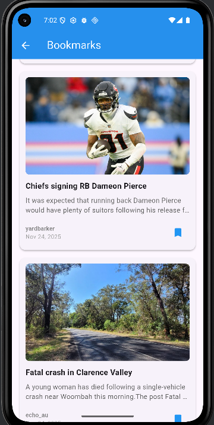
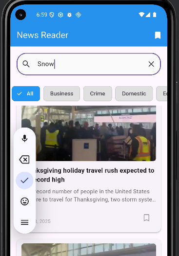
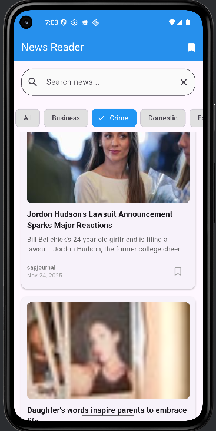

<h1 align="center"> 📰 News Reader </h1>  

<h4>👥 Nama:</h4>
🙋‍♂️ Satriya Bumi Harja: **XI/PPLG-3/24**  
---------------------------------------------------------------------------------------------------------------------------------------------------------------
 

<h3> align="center">Aplikasi Penampil Berita Sederhana Yang Dibuat Dengan <b>Flutter</b> Dan API Dari <b>newsdata.io</b></h3>  
--------------------------------------------------------------------------------------------------------------------------------------------------------------
 

<h4>⚙️ Fitur-fitur Didalam Aplikasi: </h4>
 ✔️ Dapat melihat berita di dunia 🌍  
 ✔️ Dapat menyimpan berita di bagian bookmark 🔖  
 ✔️ Pencarian berita yang ingin dicari 🔍  
 ✔️ Penyortiran berita terhadap kategori 📚  
---------------------------------------------------------------------------------------------------------------------------------------------------------------
  
 
<h4>🔑 Dokumentasi API key dari newsdata.io</h4>  
---------------------------------------------------------------------------------------------------------------------------------------------------------------
 

<h4>Kamu ingin memodifikasi aplikasi berita ini? kamu butuh layanan API dari newsdata.io, lihat caranya 👇</h4>  
---------------------------------------------------------------------------------------------------------------------------------------------------------------
 

<h3🤔 Cara mendapat API key dari newsdata.io</h3>  
1. Daftar di newsdata.io (https://newsdata.io/register)  
2. Pergi ke halaman dashboard  
3. Ambil API key mu pada menu API Keys  
---------------------------------------------------------------------------------------------------------------------------------------------------------------
 

<h4>❓ Cara Menggunakan API Key</h4>  
Masukkan API key ke request, misal: https://newsdata.io/api/1/news?apikey=YOUR_API_KEY&language=en  
---------------------------------------------------------------------------------------------------------------------------------------------------------------
 

<h3>📸 Screenshot isi aplikasi</h3>
 
Home Page

 
Bookmark Page

 
Search

 
Category
  
----------------------------------------------=================================================--------------------------------------------------------------

