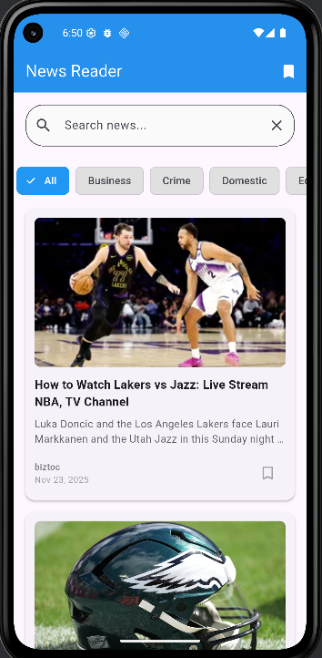

<h1 align="center"> 📰 News Reader </h1>

<h4>👥 Nama:</h4>
🙋‍♂️ Satriya Bumi Harja: **XI/PPLG-3/24**
-----------------------------------------------------------------------------------------------------------------------------
 

<h3> align="center">Aplikasi Penampil Berita Sederhana Yang Dibuat Dengan <b>Flutter</b> Dan API Dari <b>newsdata.io</b></h3>
-----------------------------------------------------------------------------------------------------------------------------
 

<h4>⚙️ Fitur-fitur Didalam Aplikasi: </h4>
 ✔️ Dapat melihat berita di dunia 🌍
 ✔️ Dapat menyimpan berita di bagian bookmark 🔖
 ✔️ Pencarian berita yang ingin dicari 🔍
 ✔️ Penyortiran berita terhadap kategori 📚
 -----------------------------------------------------------------------------------------------------------------------------
  

<h4>🔑 Dokumentasi API key dari newsdata.io</h4>
-----------------------------------------------------------------------------------------------------------------------------
 

Kamu ingin memodifikasi aplikasi berita ini? kamu butuh layanan API dari newsdata.io, lihat caranya 👇
-----------------------------------------------------------------------------------------------------------------------------
 

<h3🤔 Cara mendapat API key dari newsdata.io</h3>
1. Daftar di newsdata.io (https://newsdata.io/register)
2. Pergi ke halaman dashboard
3. Ambil API key mu pada menu API Keys
-----------------------------------------------------------------------------------------------------------------------------
 

<h4>❓ Cara Menggunakan API Key</h4>
Masukkan API key ke request, misal: https://newsdata.io/api/1/news?apikey=YOUR_API_KEY&language=en
-----------------------------------------------------------------------------------------------------------------------------
 

<h3>📸 Screenshot isi aplikasi</h3>
 
Home Page

 
Bookmark Page

 
Search

 
Category

----------------------------------------------================================----------------------------------------------

